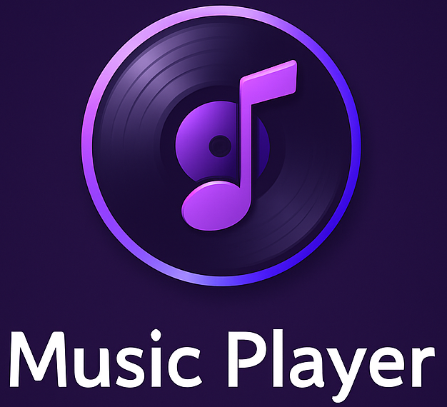
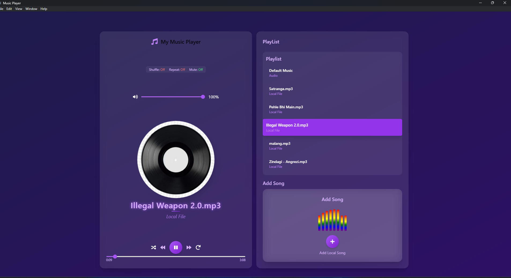

# 🎵 My Music Player

> Modern desktop music player built with **React + Tailwind CSS + Electron**  
> 🖥 Runs natively on Windows (installer included)  
> ✨ Features: beautiful dark purple theme, animated album cover, local & online songs, playlist, volume control, splash screen & tray icon
---
# ✨ Preview of Music Player


# 📺 Demo Video
<a href="https://youtu.be/aVgJQXRL1b0?si=iLKWgvBApGDmjbZ7" target="_blank" style="
  display:inline-block;
  padding:8px 16px;
  background:#4CAF50;
  color:white;
  border-radius:4px;
  text-decoration:none;
  font-weight:bold;">
  ▶️ Watch Demo
</a>

---
# 🛠 **Tech Stack**
<p>
  
  
  
  
</p>

---

# ✨ Features
✅ Dark purple professional UI  
✅ Local song upload + online URL add  
✅ Animated rotating album cover  
✅ Play, pause, skip controls  
✅ Volume & mute buttons with stylish glass card slider  
✅ Playlist (scrollable, add/remove songs)  
✅ Music progress bar & timing  
✅ Splash screen on startup  
✅ System tray icon with Show/Quit  
✅ Built as real Windows installer (.exe)  
✅ Ready to add auto‑updates

---

# 📂 Project Structure

```plaintext
music-player/
├ build/                → Icons & assets
│  └ icon.ico
├ dist/                 → Production build (generated)
├ public/               → Public static files
├ src/
│  ├ components/        → React components
│  │  ├ MusicPlayer.jsx
│  │  ├ PlayerControls.jsx
│  │  ├ SongInfo.jsx
│  │  ├ VolumeControl.jsx
│  │  ├ AddSongCard.jsx
│  │  └ RightCard.jsx
│  ├ App.jsx
│  └ index.css
├ main.cjs              → Electron main process
├ preload.cjs           → Electron preload script (optional)
├ package.json
└ README.md
```
---

# ⚙ Installation & Development
## 1️⃣ Clone the repository
```
git clone https://github.com/dhruvpatel16120/music-player.git
cd music-player
```
## 2️⃣ Install dependencies
```
npm install
```

## 3️⃣ Run in development (React + Electron)

```
npm run dev
```
+ Opens Vite dev server & Electron window
  
# 🏗 Production Build & Windows Installer

## Build frontend
```
npm run build
```

## Build installer
```
npm run dist
```
---

# ✅ Usage
+ Click “+” to add local songs 
+ Paste URL to add online songs
+ Use player controls & volume/mute buttons
+ Tray icon shows Show/Quit menu
+ Splash screen displays at startup

---

## 📦 Built With

+ React + Vite → frontend
+ Tailwind CSS → styling & dark purple theme
+ Electron → native desktop app
+ Electron Builder → Windows installer

---

## ✏ Author
Developed by Dhruv Patel.
---

## 📄 License

This project is for personal & educational purposes. Feel free to fork, learn, and build your own version! 🎵
